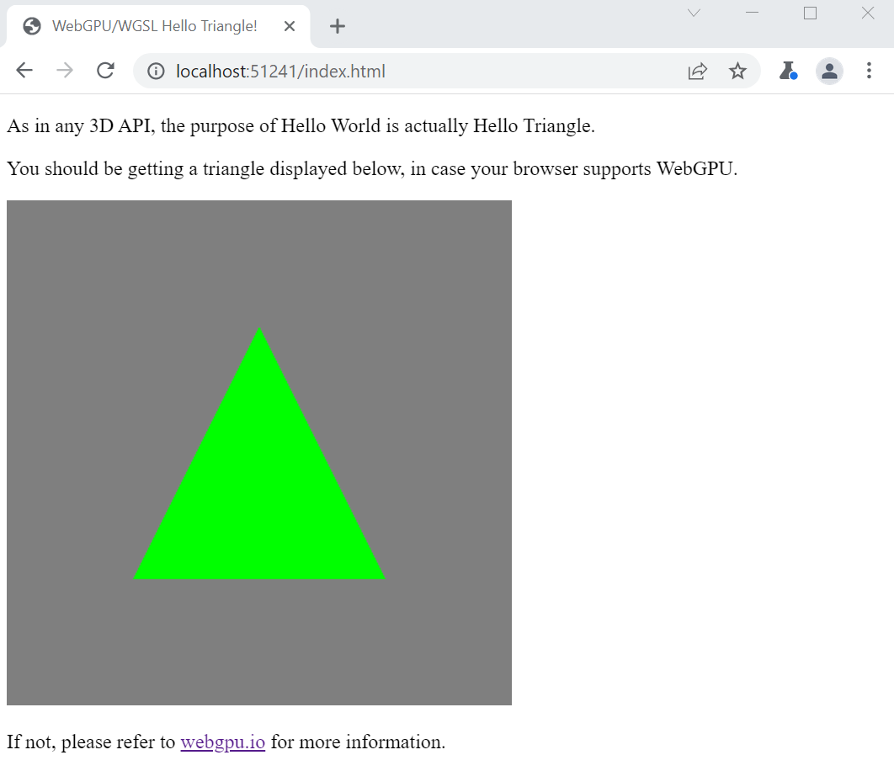

# Overview

I have created this template so that I could have an easy starting point to play with [WebGPU](https://webgpu.io), without dealing with the usual mess of FE tooling.

Only standard browser features are used, without any need for build tools, minifiers or transpilers.

WebGPU is already complex enough, no need to add extra complexity into the learning process.

# Executing

To execute this template, you need to have a WebGPU aware browser see the above link for reference.

I usually use the "Open Web Site..." feature from Visual Studio, however for convenience there is a configuration script for Python 3 under ther servers directory.

You can start it from the website root as follows:

```sh
python3 server/server.py
```

You should see something like,



# Moving forward

Feel free to pick this template and modify it at your pleasure as you get to learn about WebGPU.

Here are some resources I find interesting on the subject:

* [WebGPU standards working group](http://webgpu.io/)
* [WebGPU Samples](https://austin-eng.com/webgpu-samples/)
* [WebGPU Best Practices](https://toji.github.io/webgpu-best-practices/)
* [Raw WebGPU](https://alain.xyz/blog/raw-webgpu)